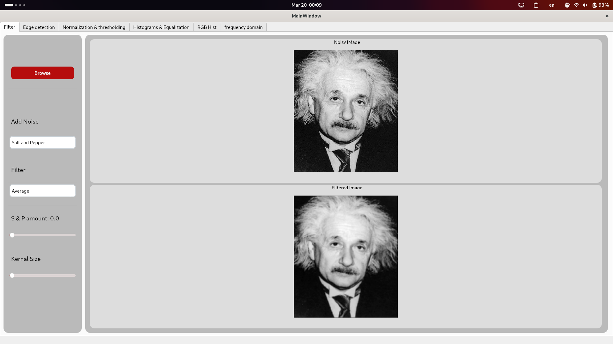

# Computer Vision Task One

## Installation
- List the dependencies required to run the code.
``` shell
pip install -r requirements.txt
```

## Run
- Run the main python file.
``` shell
python main.py
```

## Usage
- After running press on the browse button to choose any image of these extensions *.png, .jpg, .jpeg, .bmp, .gif* .



## Team Members
1. Mohamed Hazem
2. Mariam Hany
3. Farah Ossama
4. Mayar Ahmed
5. Ahmad Mahmoud